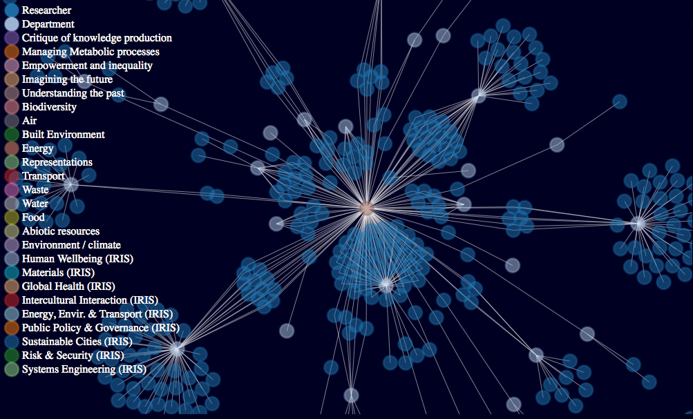

# Data_visualization

### Data visualization for Public Engagement

## Data visualization is a form of visual art that grabs our interest and keeps our eyes on the message. When we see a chart, we quickly see trends and outliers. If we can see something, we internalize it quickly. If you’ve ever stared at a massive spreadsheet of data and couldn’t see a trend, you know how much more effective a visualization can be.